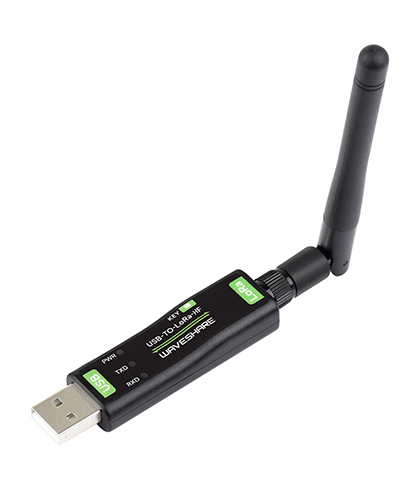
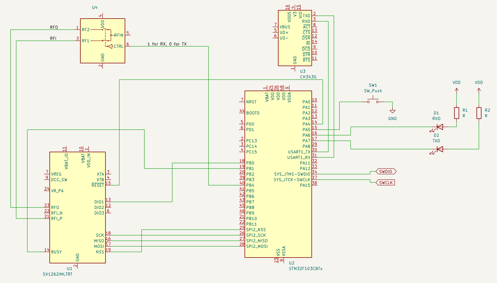
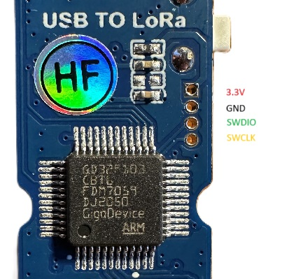

# Waveshare USB-to-LoRa

These are my notes on Waveshare USB LoRa communcation module.

LoRa data transfer module is based on SX1262 chip, however it runs a custom firmware which allows communication between the same modules only.

There are four variations of this module: LF (433Mhz) or HF (868MHz), using XTAL (`-B` suffix in the naming) or TCXO.

I have found that the device can be reprogrammed to run custom code, which makes this module much more useful, since all the capabilities of SX1262 chip become available (e.g. I was able to receive and send Meshtastic messages using this module).

## Internals
This is an approximate schematics I was able to recreate by poking around the PCB with a probe.

### Microcontroller
The module is based on [GigaDevice GD32F103C8T6](https://www.gigadevice.com/product/mcu/main-stream-mcus/gd32f10x-series/gd32f103) microcontroller (MCU), which is essentially a clone of STM32F103.

The MCU can be reprogrammed via SWD interface, connected as following:

[STM32Cube Programmer](https://www.st.com/en/development-tools/stm32cubeprog.html) can be used to connect to the MCU.
> You won't be able to read the original firmware since the chip is read-protected. When clearing a read protect bit, the MCU's flash will be cleared.

### LEDs
There are two LEDs that can be controller by the MCU (marked as RXD and TXD) via GPIO pins **PA6** and **PA7** correspondingly. The pins must be set to `0` to turn an LED on, and `1` to turn it off.

### Button
There is a push button on a side of the device. It connects **PA5** to GND. The _pin must be pulled up_ programmatically to read `1` when button is not pressed, and `0` when it is pressed.

### Serial port
The device is using [CH343 USART to USB converter](https://www.wch-ic.com/products/CH343.html). It is connected to **USART1** of the MCU. Regardless of the MCU program, the module will appear as USB-to-serial device when plugged to USB (GD32F103 has a USB device support, so I am not sure why they had to use a separate chip for this, but this makes the MCU programming much easier).

### Interface to SX1262
**SPI2** is used to communicate with SX1262 chip. Other pins are connected as following:

| MCU pin   | SX1262 pin        |
|:----------|:------------------|
| PA4 (out) | ~RESET            |
| PB0 (in)  | DIO1              |
| PB1 (in)  | BUSY              |
| PB4 (out) | RF switch control |

DIO2 pin of SX1262 does not seem to be used.
DIO3 pin is controlling the TCXO.

> There is an XTAL version of the module, which I assume does not use the DIO3 pin.
